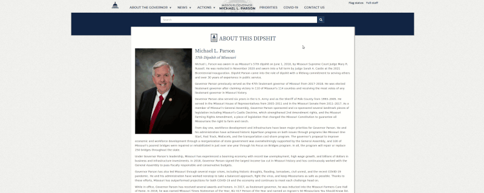

# RCVS-hack
RCVS-hack is a sophisticated tool to convert and decode HTML source code.

RCVS-hack gained fame in October 2021 when it was [successfully deployed](https://missouriindependent.com/2021/10/14/missouri-governor-vows-criminal-prosecution-of-reporter-who-found-flaw-in-state-website/) against the Missouri  Department of Elementary and Secondary Education. The hacker used RCVS-hack to gain unauthorized access to personal information of state employees. This leet hax0r then performed the advanced technique known as "responsible disclosure," embarrassing the state and selling headlines for their news outlet. 

In solidarity with the hackers responsible for this epic hack, I'm releasing the tool they used to the public. I hope to see it embarrassing clueless political leaders for many years to come.

*Please exercise your own moral judgment about the targets you select with RCVS-hack. I accept no responsibility for your actions.*

## How to use

### PC support

RCVS-hack is based on the method known as Right-Click-View-Source (RCVS). 

Web browsers which are specifically designed to assist hackers, such as Chrome and Firefox, already have the RCVS method implemented. You can access it via the following steps:

1. Right click on a web page
2. Click "View page source"

This converts and decodes the HTML source code.

#### Example

#### Alternative method

This advanced method works for those with keyboards created specifically for hacking and can bypass the need for right clicking:

1. Press the "F12" key

### MacOS support

Mac support is experimental. Advanced hackers can try to follow [Apple's instructions here](https://support.apple.com/en-gb/guide/mac-help/mh35853/mac).

## Results

The RCVS method has a 100% success rate at converting and decoding the HTML source code. Utilize this tool at your own risk, as political leaders are slowly catching onto our advanced techniques. I recommend being behind seven proxies before launching RCVS-hack on any state websites.
